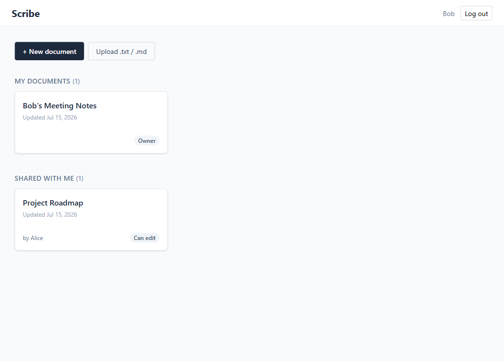

# Scribe

A small full-stack **rich-text document editor**: create, rename, edit, autosave,
and reopen documents; upload a `.txt` / `.md` file to start a new one; share with
viewer / editor roles; export to Markdown or PDF. Built as a focused product slice —
a usable editing flow, a sharing model that is actually enforced, and the
engineering scaffolding (validation, tests, one-command run, live deploy) around them.

- **Live demo:** `https://<your-app>.koyeb.app` *(paste the Koyeb URL here once deployed)*
- **Run locally:** `docker compose up --build` → **http://localhost:8000**
- **Log in with:** `alice@example.com` / `demo1234` (two more accounts below)



---

## Features

- **Rich-text editing** — bold, italic, underline, three heading levels, and
  bulleted / numbered lists, powered by [TipTap](https://tiptap.dev). Content is
  stored as sanitized HTML, so formatting round-trips exactly when you reopen a
  document.
- **Create, rename, autosave** — new documents, inline title editing, and
  debounced autosave with a live `Saving… / All changes saved` indicator
  (Ctrl / Cmd-S forces an immediate save).
- **File upload** — upload a **`.txt`** or **`.md`** file (≤ 1 MB) to turn it into
  a new editable document. Markdown structure is converted to rich text; the file
  picker and this README both state the supported types. Other types, and files
  over the limit, are rejected server-side with a clear message.
- **Sharing** — a document owner shares with another user by email and picks a
  role: **Viewer** (read-only) or **Editor** (can edit and rename). The dashboard
  separates **My documents** from **Shared with me**, each item tagged with your role.
- **Export** — download a document as **Markdown** (server-side), or
  **Print → Save as PDF** via a dedicated print stylesheet (client-side).
- **Auth** — lightweight session-cookie login (bcrypt hashing) with three seeded
  demo accounts.

---

## Quick start (Docker — recommended)

Requires Docker Desktop. From the repository root:

```bash
docker compose up --build
```

Then open **http://localhost:8000**.

The SQLite database is created and seeded automatically on first boot and stored in
`./data/` on your host, so **locally your documents survive `docker compose down` and
restarts**. To start completely fresh, delete the `./data/` folder.

---

## Live deployment

Scribe is deployed **live on Koyeb** (free tier, no credit card) as a **single Docker
service** built straight from this repo — FastAPI serves the built SPA *and* the API
on one port, so there is one thing to deploy and one URL to share. Full step-by-step
instructions are in **[`DEPLOY.md`](DEPLOY.md)**.

> **Persistence on the live demo (stated honestly):** Koyeb's free instance has an
> ephemeral disk, so the SQLite DB resets on restart/redeploy. The app **re-seeds on
> every boot**, so the demo users and the pre-shared "Project Roadmap" are always
> present and the sharing flow is always demonstrable; documents a reviewer creates
> persist until the next restart. Running locally (above) persists normally via the
> `./data` volume. Durable cloud storage (a persistent volume or managed Postgres via
> `DATABASE_URL`) is a documented next step, not a rewrite.

---

## Seeded demo accounts

All three accounts share the password **`demo1234`** (demo-only, seeded in
`backend/app/seed.py`).

| Email | Name | Starts with |
|---|---|---|
| `alice@example.com` | Alice | Owns "Welcome to Scribe" and "Project Roadmap"; shares the roadmap with Bob & Carol |
| `bob@example.com` | Bob | Owns "Bob's Meeting Notes"; is an **editor** on Alice's roadmap |
| `carol@example.com` | Carol | Is a **viewer** on Alice's roadmap |

**To see sharing end to end:** log in as **Alice** → open "Project Roadmap" → click
**Share** to see Bob (editor) and Carol (viewer). Then log out and log in as **Bob**
(can edit the shared roadmap) or **Carol** (opens read-only, no toolbar).

---

## Running locally without Docker

Two terminals. **Backend** (Python 3.12):

```bash
cd backend
python -m venv .venv
source .venv/bin/activate          # Windows: .venv\Scripts\activate
pip install -r requirements.txt
uvicorn app.main:app --reload      # serves the API on http://localhost:8000
```

**Frontend** (Node 20+):

```bash
cd frontend
npm install
npm run dev                        # Vite dev server on http://localhost:5173
```

Open **http://localhost:5173**. The Vite dev server proxies `/api` to the backend on
port 8000, so both halves work together with hot reload. (In Docker and on Koyeb there
is no proxy — FastAPI serves the pre-built frontend directly on the single port.)

---

## Running the tests

**Backend** — 12 tests covering access control (viewer-vs-editor, non-collaborator
404-not-403), upload conversion + sanitization, and auth:

```bash
cd backend
source .venv/bin/activate           # Windows: .venv\Scripts\activate
pytest -v
```

**Frontend** — 3 unit tests for the permission logic, plus a clean `tsc --noEmit`:

```bash
cd frontend
npm test
```

---

## Tech stack

| Layer | Choice |
|---|---|
| Backend | Python 3.12, FastAPI, SQLAlchemy 2, Pydantic v2 |
| Auth | Signed-cookie sessions, bcrypt password hashing |
| Storage | SQLite (file-based; no external service) |
| Content safety | `bleach` allow-list sanitization on every write / upload |
| Frontend | React 19 + TypeScript, Vite, TipTap 3 (StarterKit), Tailwind CSS v4, React Query |
| Packaging | One multi-stage Docker image, one service on one port (honors `$PORT`) |

See [`docs/ARCHITECTURE.md`](docs/ARCHITECTURE.md) for the reasoning behind these
choices and [`docs/AI_WORKFLOW.md`](docs/AI_WORKFLOW.md) for how AI was used (including
two real bugs it caught that the unit tests could not).

---

## Known limitations (stated honestly)

- **Markdown import preserves *basic* formatting only** — headings, bold, italic,
  lists, and blockquotes. Links, code blocks, images, and tables are stripped by the
  sanitizer. This is deliberate: the editor's schema and the server sanitizer are
  intentionally aligned to **one safe subset**, which is also what makes formatting
  round-trip losslessly and blocks stored XSS. Widening import (links / code) is a
  listed next step.
- **Autosave is last-write-wins** — no operational-transform / CRDT merge, and no
  real-time collaboration. On a document two editors have open at once, the last save
  wins.
- **The live Koyeb instance uses a free ephemeral disk** — it re-seeds on boot (see
  the deployment note above). Local runs persist via the `./data` volume.

---

## Project status

**Working end to end:**
- Create / rename / edit / autosave / reopen with formatting preserved
- `.txt` and `.md` upload → new document (converted + sanitized)
- Sharing by email with viewer / editor roles; owned vs shared clearly separated
- Access control enforced **server-side** (viewers can't edit; non-collaborators get 404)
- Markdown + PDF export
- Persistence across refresh and restarts (SQLite volume locally)
- Automated tests (12 backend + 3 frontend), clean `tsc --noEmit`, one-command Docker run
- **Deployed live on Koyeb** as a single service (see [`DEPLOY.md`](DEPLOY.md))

**Intentionally deprioritized:**
- Real-time collaboration, comments, and version history — each is a project in itself.
- `.docx` upload — needs a heavier converter for marginal demonstration value.
- Self-serve registration / password reset — accounts are seeded to demonstrate
  multi-user sharing without account-lifecycle management.

**What I'd build next with another 2–4 hours:**
1. **Document version history** — snapshot on save + a restore panel (the schema
   already isolates content on the document row, so this is additive).
2. **`.docx` upload** via a converter such as `mammoth`, to broaden the import story.
3. **Widen Markdown import** to preserve links and code blocks (extending the editor
   schema + sanitizer allow-list together).
4. **Real-time presence indicators** as the first step toward safe multi-editor use.

---

## Supported upload types

Only **`.txt`** and **`.md`**, up to **1 MB**. This limit is enforced on the server
and surfaced in the UI (the file picker filters to these types; unsupported or
oversized files return a clear error).
